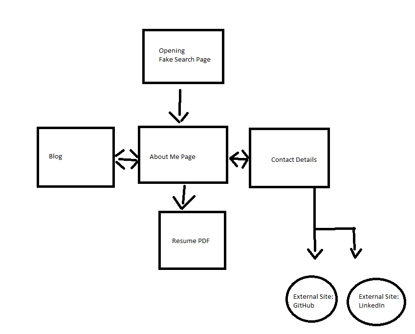
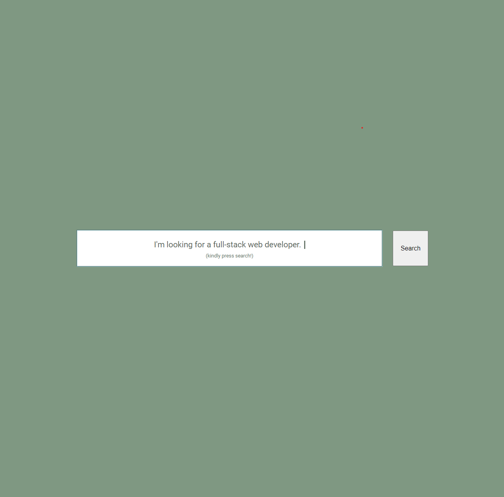
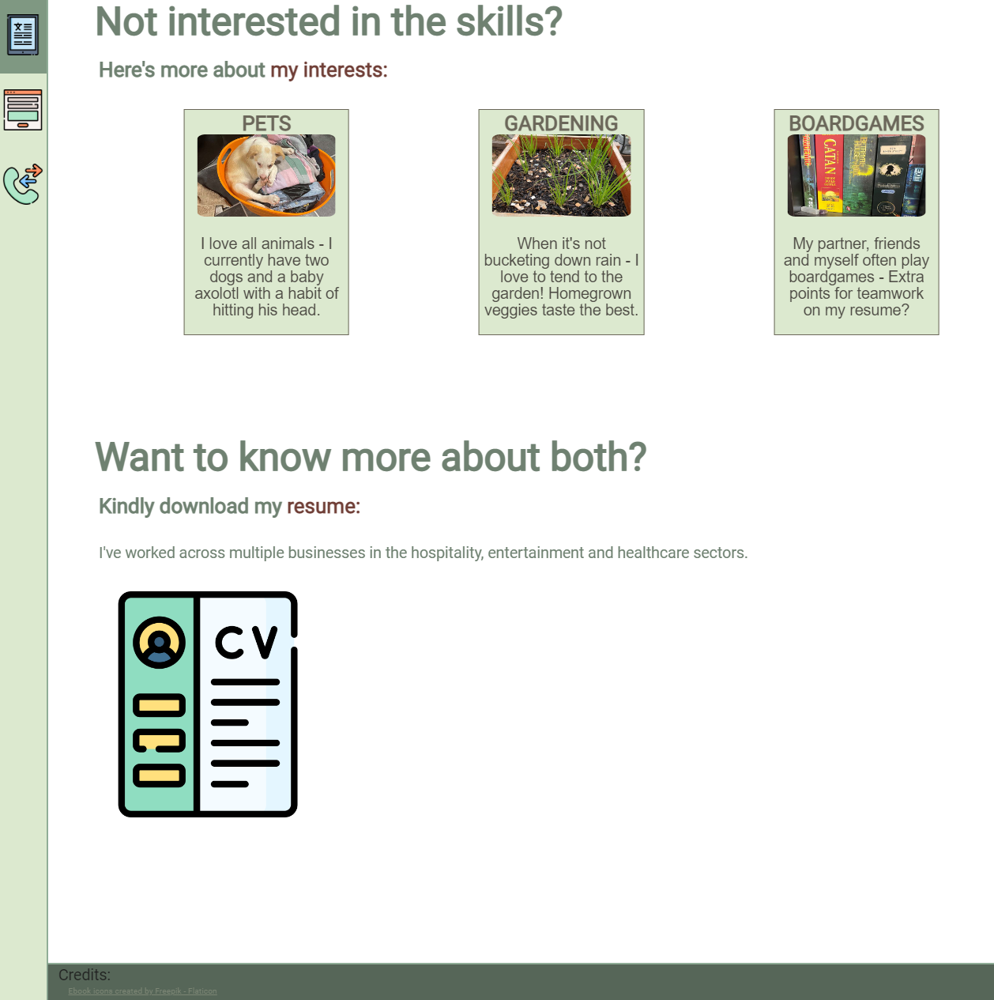
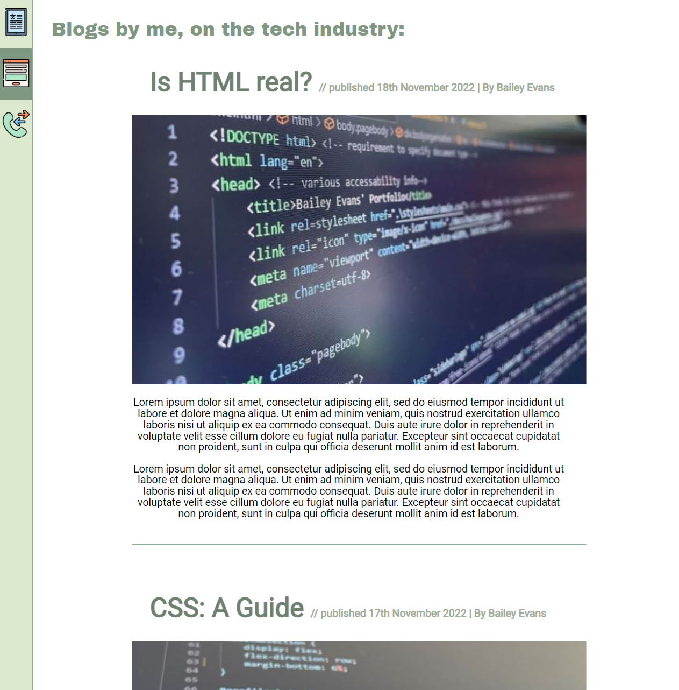
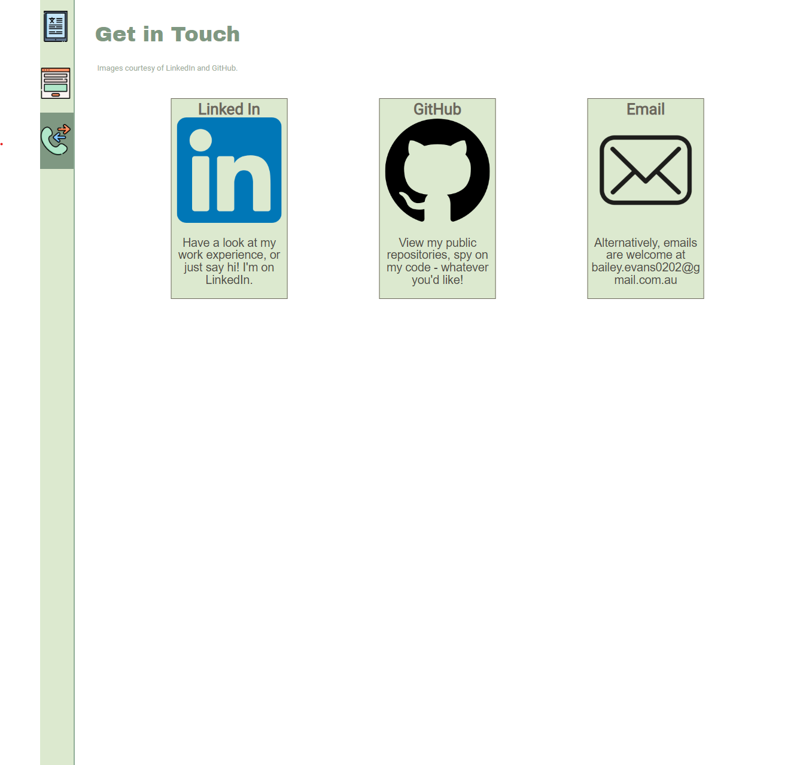

# t1a2-portfolio README by Bailey Evans  

  

## Important Links
[Website Link](https://silly-sorbet-94c845.netlify.app/)

[GitHub Repo](https://github.com/Bailey117/t1a2-portfolio)

[Presentation Video](https://youtu.be/8AacfseVG0w)  

## Website Description
### Purpose 
This website was created for two primary reasons:  

1. To complete the T1A2 Portfolio assignment for the Coder Academy Bootcamp.
2. To act as a platform to demonstrate my developing coding skills, and understanding of different coding languages.  

### Functionality 
The website was designed to be simplistic and easy to read with a pastel colour palette. 

Responsiveness was also implemented, allowing viewers to read it on a variety of devices.  
###  Features
The main features of the website include animations - This was in an attempt to show website fluidity and design skill that attracts any prospective employers.

### Sitemap 

    As the sitemap shows, the user starts on the fake search page - they are then
    prompted to search for a full stack developer which takes them to the about
    me page, which can access the other pages and vice versa. 

    The about me page also links to a PDF of my resume, and the contact details page
    links to my GitHub and the LinkedIn website (this links directly to the website
    as I do not have a LinkedIn.)

###  Target Audience
The target audience for this website is for prospective employers once I have received my qualifications.
### Tech Stack
This website features HTML and CSS coding.

## Screenshots

### Opening Page

### About Me Page

### Blog Page
###### Note: only a portion of this is shown as it is much the same.

#### Contact Details Page
